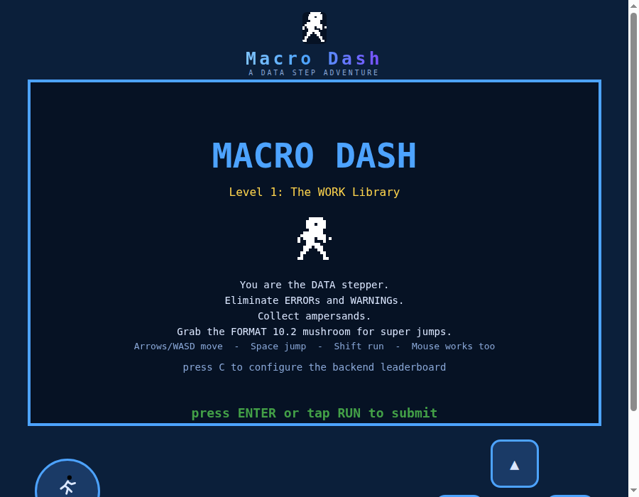

# Macro Dash

**[Play the game now - https://dash.sasjs.io](https://dash.sasjs.io)**



You are the DATA stepper. Bounce through the WORK library, stomp ERRORs and WARNINGs, collect ampersands, grab the FORMAT 10.2 mushroom for super jumps, and get your report to the portal before the job runs out of steam. One run, all levels - amps, health and the speedrun clock carry over. Finish with 0 ERRORs and 0 WARNINGs for the clean-log stamp, and put your initials on the leaderboard.

Arrows / WASD to move, Space to jump, hold Shift to RUN. Works on mobile too (on-screen controls).

## But it is not really a game

Macro Dash is a working demonstration of how to craft and deploy **data-powered web apps on SAS** - the same architecture behind production applications like [Data Controller](https://datacontroller.io):

- A **frontend** (plain HTML/JS canvas, strict CSP, no framework) streamed directly from SAS - no separate web tier to build, secure or maintain.
- **Backend services written in SAS** (`sasjs/services/`) that receive tables from the browser, run SAS code, and return JSON. The game uses three: `configure`, `getscores`, `savescore` - a complete, persistent, server-side leaderboard.
- **One codebase, every flavour of SAS**: deploy to SAS Viya, SAS 9 EBI or [SASjs Server](https://github.com/sasjs/server) with a single command (`sasjs cbd`), using [@sasjs/cli](https://github.com/sasjs/cli) and the [@sasjs/core](https://github.com/sasjs/core) macro library.
- **Graceful degradation**: with no backend reachable, the game falls back to localStorage mode (personal best, no leaderboard) - the same pattern you want in resilient production apps.

If you can build this, you can build a data capture form, an approvals workflow, a parameter manager or a reporting portal on your own SAS platform. The [PLAN.md](PLAN.md) and [AGENTS.md](AGENTS.md) files document the design decisions; the services are deliberately small and readable.

Want to build apps like this on your SAS estate? Start with the [SASjs framework](https://sasjs.io), or talk to us at [4GL Apps](https://sasapps.io).

## Local development (no SAS required)

```bash
npm install
npm run devsetup
```

That's it. `devsetup` (scripts/devsetup.js) downloads the `@sasjs/server` binary for your platform from [GitHub releases](https://github.com/sasjs/server/releases/latest) into `tools/sasjs-server/`, writes a `.env` (desktop mode, JS runtime - no SAS installation needed), starts the server on port 5000, deploys the app (`sasjs cbd -t local`) and the JS mocks, then prints the URL:

**http://localhost:5000/AppStream/MacroDash/**

The script is idempotent - existing downloads and `.env` edits are kept, and an already-running server is reused. Server logs: `tools/sasjs-server/server.log`. (If your shell exports `NODE_OPTIONS`, the bundled Node may reject it - the script already starts the server with `NODE_OPTIONS=""`.)

The four backend services are executable JS mocks (same pattern as react-seed-app / Data Controller), deployed to SASjs Drive where they shadow the `.sas` services. The leaderboard works end-to-end: settings persist on the SASjs Drive (`<drive>/macrodash.settings.json`), scores in the configured rootdir as `scores.json` (the mock analogue of `sb.scores`), and the mock `configure.js` even stamps `configured="true"` into the streamed `index.html` via the Drive API - like the real SAS service. Nothing is written to /tmp.

### Day-to-day

```bash
npm run deploy       # redeploy app to the local server (sasjs cbd -t local)
npm run mock:deploy  # redeploy only the mocks (scripts/deploy-mocks.js)
```

To reset the mock state: delete `<drive>/macrodash.settings.json` (under `tools/sasjs-server/sasjs_root/drive/`) and the configured rootdir's `scores.json`.
To stop the server: `pkill -f api-linux` (or `api-macos` / `api-win.exe`).

### Other scripts

- `npm start` - static-only serving of `src/` on :8000 (no backend; localStorage mode)
- `npm test` - reachability test (BFS over engine physics for all levels)
- `npm run prepare` - refresh `src/sasjs.js` from `node_modules/@sasjs/adapter`

## GitHub Pages (backend-free)

`.github/workflows/pages.yml` deploys the static game on every push to `main`: `npm ci` (regenerates the gitignored `src/sasjs.js`), `npm test`, then publishes `src/`. With no SAS server reachable the game simply runs in localStorage mode (personal best, no leaderboard). The public game runs at [dash.sasjs.io](https://dash.sasjs.io) via the `src/CNAME` custom domain.

One-time repo setup: Settings - Pages - Source = "GitHub Actions".

## Deploy to SAS Viya (one line, no install)

Every release ships a single self-contained deploy script — `macro-dash-viya.sas` — that streams the frontend and installs the backend services straight onto your SAS Drive. No Node, no `@sasjs/cli`, no build step: run it from SAS Studio, SAS Enterprise Guide, or any batch SAS session.

```sas
%let apploc=/your/viya/folder;
filename md url "https://github.com/sasjs/macro-dash/releases/latest/download/macro-dash-viya.sas";
%inc md;
```

That's the whole deployment. Set `apploc` to wherever you want the app to live on Drive (it's created if it doesn't exist), and the script does the rest: uploads the streamed `MacroDash.html` + assets, registers the `configure` / `getscores` / `savescore` services, and prints the app URL when it's done:

```
<SAS Viya base>/SASJobExecution?_FILE=/your/viya/folder/services/MacroDash.html
```

Open that URL and the game loads. On first visit you'll get the in-game **configuration screen** — pick a results folder for the leaderboard (a physical folder SAS can write `scores.sas7bdat` to), optionally choose the compute context and a `runAsTask` / `useComputeApi` execution mode, and submit. The `configure` service writes `settings.sas` into your apploc and flips `configured="true"` in the streamed `MacroDash.html`, so every subsequent load skips setup and the leaderboard is live for everyone. To reconfigure later, just revisit the config screen.

### Deploy from source / to other platforms

The release artefacts are built by CI from `sasjs/` on every push to `main`. To build and deploy directly from a checkout (e.g. for SASjs Server or SAS 9, or to push to Viya without the release script), the targets live in `sasjs/sasjsconfig.json`:

```bash
sasjs cbd -t viya      # or: server | sas9
```

`sasjs cbd` compiles the macros + services, builds the streaming web bundle, and deploys a service pack to the target's `appLoc` in one shot. The `server` target points at the public [sas.4gl.io](https://sas.4gl.io) SASjs Server instance; the public game on [dash.sasjs.io](https://dash.sasjs.io) is the backend-free GitHub Pages build.

---

Made with ❤️ by [4GL Apps](https://sasapps.io)
